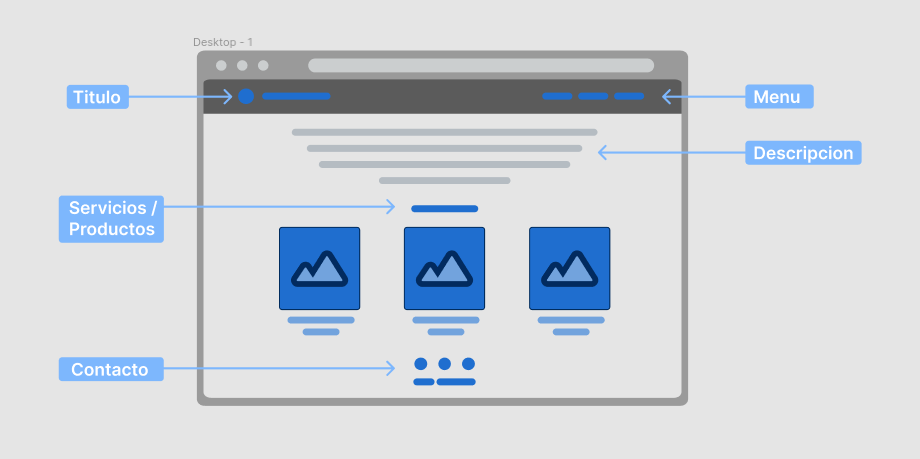

# Desafío 1:
*En estos desafios simularemos que pertenecemos a una empresa que se dedica al desarrollo web.*

Una empresa nos contacta para crear un diseno e implementarlo.
Como primer paso conversamos con el cliente sobre lo que necesita.

En este punto debemos ponernos del lado del cliente y definir:

* TEMÁTICA: 
 ¿A que se dedica la empresa? ¿Qué productos/servicios ofrece?

* BRANDING:
¿Cuál será el nombre de la empresa? ¿Que logo utilizaremos? 

Luego de conversar con el cliente creamos el siguiente esquema de cómo va a ser la página.

Ahora pasemos al diseño de la pagina pero para ello algunas aclaraciones:

* TITULO:
    Debe contener el logo y el nombre de la empresa.

* MENU:
Deben contener las secciones **Nosotros**, **Servicios** y **Contacto** las cuales llevará a la sección correspondiente dentro de la misma pagina. 

* DESCRIPCION:
Una descripción sobre la empresa.

*  SERVICIOS/PRODUCTOS:
Debe incluir 3 servicios o productos y por cada uno una foto y una breve descripcion sobre la foto.

* CONTACTO: Debe aparecer los logos de las redes sociales (facebook, instagram y
whatsapp) con links a cada una (ficticiamente), más un texto con la dirección ficticia de la empresa.

> Es importante que la pagina mantenga los elementos que conversamos con el cliente.

*La página por ahora deberia quedar algo asi:*

# Desafío 2:

Pensemos en el diseño...
Ahora vamos a pasar a elegir:
* 2 colores principales
* 1 gris claro, 1 girs medio y 1 gris oscuro
* 1 fuente de [google fonts](https://fonts.google.com/) **(opcional)**.

*En esta instancia la pagina deberia parecerce al siguiente sitio:*
 

> Lo ideal es que lo tengan armado antes del **\<fecha estimada\>**, deberán compartirlo en los foros y entre todos vamos
dando nuestro feedback de cada proyecto.

